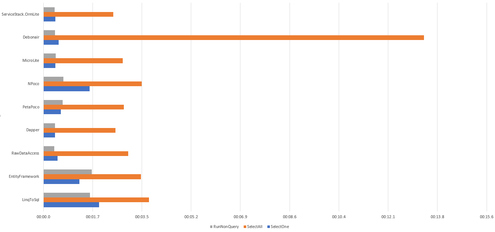

# ORM Comparison
This project compares ORM code style and performance when executing stored procedures and mapping the results to existing POCOs

Out of scope are any comparisons for mapping the whole database or generate SQL for database interactions. Athough the tests could be expanded to do this if you want.

## Setup
I've included a database script for creating the database objects and data.

The tests all work with a single table of 300 records containing Int, String, Datetime, Boolean and Guid. There are 3 stored procedures

- `GetSingleRecord` pulls out a single record from the 300
- `GetAllRecords` pulls out all 300 records
- `ExecuteNonQuery` takes a parameter of each type plus an output parameter (to represent selecting the id of a newly inserted record). It doesn't return anything

## The Tests
Using each ORM each Stored Procedure is timed while being executed 5000 times. Before the timed run each Store Procedure is executed 500 times to allow the ORM and Database to warm up.

## The Results
As important as speed is the look of the code, but beauty is in the eye of the beholder so you will have to look at the source yourself. Also,take a look at the false starts section below.

Orm                      	   |SelectOne       	   |SelectAll       	   |RunNonQuery
-------------------------------|-----------------------|-----------------------|---------------
RawDataAccess                  |00:00:01.9126101       |00:00:05.0644817       |00:00:01.3035870
EntityFramework                |00:00:03.9955127       |00:00:08.8974535       |00:00:05.7639858
EntityFrameworkCore            |00:00:03.0121316       |00:00:09.9225503       |00:00:01.7892548
LinqToSql                      |00:00:03.6203172       |00:00:07.4801082       |00:00:02.8967806
Dapper                         |00:00:01.5413370       |00:00:10.4132520       |00:00:01.3893271
PetaPoco                       |00:00:03.5615154       |00:00:09.9040671       |00:00:02.1176574
NPoco                          |00:00:04.4666562       |00:00:13.3185543       |00:00:01.4555433
MicroLite                      |00:00:01.5164151       |00:00:04.9687992       |00:00:01.5089604
Debonair                       |00:00:01.4791524       |00:00:29.5297591       |00:00:01.2743130
ServiceStack.OrmLite           |00:00:01.5202964       |00:00:05.1525614       |00:00:01.1089368

### * Notes
1. Debonair and Microlite are included in the results, however, there doesn't seem to be a way to get the value of an output parameter using them, so really ... they fail the test.
2. I've removed Debonair from the Graph as the SelectAll result of 29.5 seconds skews the graph

